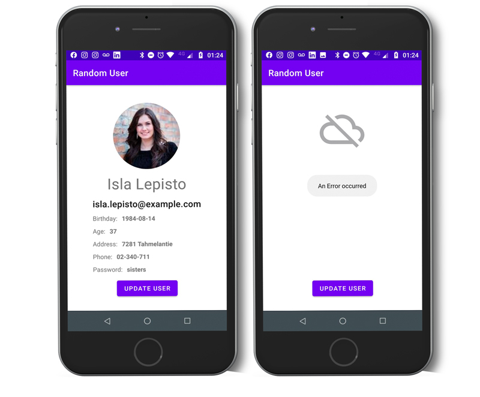

Random User
===================================

An app to fetch a random user from https://randomuser.me/ and display the results on UI

With an "update user" button you can fetch a random user from a Rest API.

Unit tests were implemented using a Mockserver.

Network errors were handled.

Architecture: MVVM

It also uses a repository pattern so in the future it will be possible to cache results at a local database.

Purpose
--------------

This code demonstrates how to implement:

* Retrofit, Moshi and Coil
* Data and Domain Layer
* ViewModel and LiveData
* Data Binding and custom Binding Adapters
* Unit testing with a mockserver

Other tools used:

* JSON To Kotlin Class Plugin (JsonToKotlinClass)
* Postman (API client tester)

Getting Started
---------------

1. Download and run the app.
